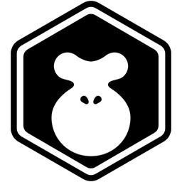

# NoblePig-BigPig.github.io

This repository hosts a collection of web-based projects and prototypes.

## Projects

Here is a list of the projects currently available:

1.  **Project 1: Image Difference Comparison**
    *   **Description:** A tool to compare two images and highlight their differences.
    *   **Link:** [./subPage_1/index.html](./subPage_1/index.html)

2.  **Project 2: Rewarded Ad Revenue Model Prototype**
    *   **Description:** A prototype demonstrating a rewarded ad-based revenue model.
    *   **Link:** [./subPage_2/index.html](./subPage_2/index.html)
    *   **Image:**
        

3.  **Project 3: Spirit Summoning Game Prototype**
    *   **Description:** A prototype for a spirit summoning game.
    *   **Link:** [./subPage_3/index.html](./subPage_3/index.html)
    *   **Image:**
        

4.  **Project 4: Fairygui x LayaAir Official Test**
    *   **Description:** An official test project for Fairygui and LayaAir integration.
    *   **Link:** [./subPage_4/index.html](./subPage_4/index.html)
    *   **Image:**
        

5.  **Project 5: Shi Yiguang "唯一" Song Screen Recording Player**
    *   **Description:** A screen recording player for the song "唯一" by Shi Yiguang.
    *   **Link:** [./subPage_5/index.html](./subPage_5/index.html)
    *   **Image:**
        
