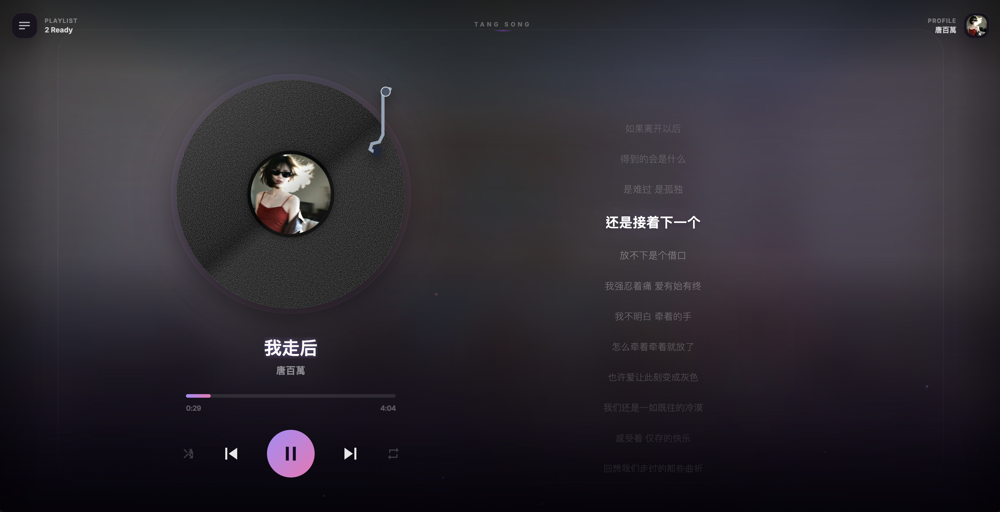
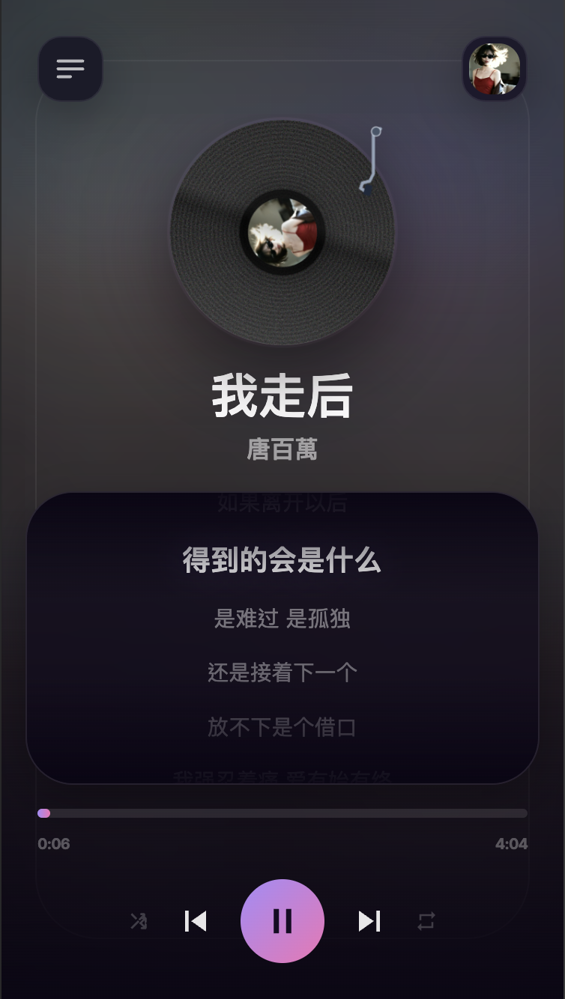

# ms.million

一個以黑膠播放器為視覺核心的音樂站，前端用 React + Vite，後端用 Express + SQLite。

目前已支援：

- 播放器、播放清單、同步歌詞
- 音檔與封面上傳
- 使用者頭像、暱稱、首頁背景圖上傳
- 背景圖鋪底 + 毛玻璃氛圍
- Whisper 自動綁定歌詞
- Cloudflare 自有網域對外暴露

這份 README 偏重「讓接手的人或 agent 快速看懂現在專案怎麼跑、哪裡要改」。

## 1. 專案結構

```text
ms.million/
├─ src/
│  ├─ App.tsx                     # 主畫面、播放器狀態、桌機/手機版版型
│  ├─ api.ts                      # 前端 API 包裝
│  ├─ types.ts                    # 前端型別
│  ├─ utils/lrcParser.ts          # LRC 解析
│  └─ components/
│     ├─ VinylPlayer.tsx          # 黑膠唱盤元件
│     ├─ AudioControls.tsx        # 播放控制列
│     ├─ LyricScroller.tsx        # 歌詞區
│     ├─ PlaylistDrawer.tsx       # 播放清單抽屜
│     ├─ UserPanel.tsx            # 右上角個人面板
│     └─ UploadModal.tsx          # 上傳歌曲彈窗
├─ server/
│  ├─ index.ts                    # Express API 入口
│  ├─ db.ts                       # SQLite schema / query helpers
│  ├─ whisper.ts                  # Node -> Python Whisper 橋接
│  ├─ whisper_transcribe.py       # 真正的轉錄與 LRC 生成邏輯
│  ├─ data/tang.db                # SQLite 資料庫
│  └─ uploads/                    # 音檔、頭像、背景、封面
├─ index.html
├─ vite.config.ts
└─ package.json
```

注意：

- `server/*.js` 是現場產物，不是主要維護來源。真正應該改的是 `server/*.ts` 和 `server/whisper_transcribe.py`。
- Tailwind v4 要用 `@import "tailwindcss";`，不要再改回舊的 `@tailwind base/components/utilities`。

## 2. 技術棧

- 前端：React 19、TypeScript、Vite 8、Tailwind CSS v4
- 後端：Express 5、TypeScript、multer
- 資料庫：better-sqlite3
- 歌詞綁定：本機 Python + `openai-whisper`
- 對外發布：Cloudflare Tunnel

## 3. 產品展示

### 桌面版


### 行動版
